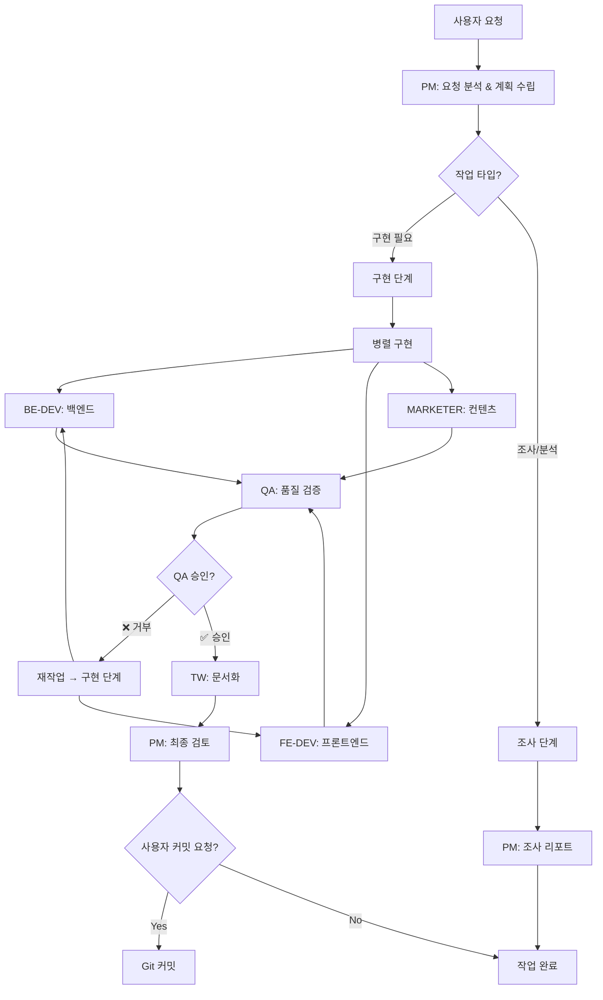

# 에이전트 협업 가이드

이 프로젝트는 전문화된 에이전트 팀이 협업하여 작업을 수행합니다. 각 에이전트는 명확한 역할과 책임을 가지며, 정의된 워크플로우에 따라 상호작용합니다.

---

## 🎭 에이전트 역할

| 에이전트 | 약칭 | 역할 | 주요 책임 |
|---------|------|------|----------|
| **Project Manager** | PM | 프로젝트 오케스트레이터 | 계획 수립, 에이전트 위임, 전체 조율 |
| **Backend Developer** | BE-DEV | 백엔드 구현 | API, 비즈니스 로직, DB 통합, 성능 최적화 |
| **Frontend Developer** | FE-DEV | 프론트엔드 & UX | UI 컴포넌트, 반응형 디자인, 접근성, 사용자 인터랙션 |
| **Marketing Content Writer** | MARKETER | 마케팅 & 브랜딩 | 랜딩페이지, 브랜드 가이드, README, 홍보 전략 |
| **QA Engineer** | QA | 품질 보증 | 테스트 검증, 엣지 케이스, 코드 품질, 스펙 준수 |
| **Technical Writer** | TW | 기술 문서화 | API 문서, 아키텍처 문서, CLAUDE.md, 개발자 가이드 |

---

## 🔄 협업 워크플로우

### **전체 프로세스**



---

## 📋 작업 흐름 상세

### **1단계: 계획 수립 (PM)**

**PM의 책임:**
- 사용자 요청 분석 및 작업 분류
- 필요한 에이전트 식별 및 위임
- 작업 우선순위 및 의존성 정의
- 계획 문서 작성 (PLAN.md, PRD)

**출력:**
- 구현 계획서
- 에이전트별 작업 지시
- 인터페이스 계약 (BE-DEV ↔ FE-DEV, MARKETER ↔ FE-DEV)

---

### **2단계: 병렬 구현**

#### **BE-DEV (백엔드 구현)**

**입력:**
- PM의 구현 계획
- API 스펙 및 데이터 모델
- FE-DEV와 합의한 API 계약

**작업:**
- API 엔드포인트 구현
- 비즈니스 로직 개발
- 데이터베이스 통합
- 에러 핸들링 및 검증

**출력:**
- 구현된 백엔드 코드
- 단위/통합 테스트
- API 문서 초안

**협업:**
- FE-DEV: API 계약 준수
- QA: 테스트 가능한 코드 작성

---

#### **FE-DEV (프론트엔드 구현)**

**입력:**
- PM의 UI/UX 요구사항
- MARKETER의 브랜드 가이드
- BE-DEV와 합의한 API 계약

**작업:**
- UI 컴포넌트 개발
- 반응형 디자인 구현
- 사용자 인터랙션 로직
- 접근성 및 성능 최적화

**출력:**
- 구현된 프론트엔드 코드
- 컴포넌트 테스트
- 스타일 가이드

**협업:**
- BE-DEV: API 연동 및 데이터 처리
- MARKETER: 브랜드 가이드 반영, UI 카피 통합
- QA: UI/UX 테스트 시나리오 제공

---

#### **MARKETER (마케팅 컨텐츠)**

**입력:**
- PM의 프로덕트 비전
- 타겟 오디언스 및 핵심 메시지
- 경쟁사 분석

**작업:**
- 브랜드 가이드라인 개발
- 랜딩페이지 카피 작성
- README.md 개선
- UI 카피 가이드라인

**출력:**
- 브랜드 가이드 문서
- 마케팅 컨텐츠
- UI 마이크로 카피

**협업:**
- FE-DEV: 브랜드를 UI로 구현, 카피 통합
- TW: 마케팅 컨텐츠를 기술 문서와 통합

---

### **3단계: 품질 검증 (QA)**

**입력:**
- BE-DEV, FE-DEV, MARKETER의 작업 결과
- PM의 스펙 문서 및 Acceptance Criteria

**작업:**
- 단위/통합 테스트 실행
- 엣지 케이스 검증
- 코드 품질 평가
- 스펙 준수 확인
- 브랜드 컴플라이언스 체크

**출력:**
- QA 리포트
- 발견된 이슈 목록
- 커밋 승인/거부 결정

**승인 조건:**
- ✅ 모든 테스트 통과
- ✅ 커버리지 80% 이상
- ✅ TypeScript 에러 없음
- ✅ 스펙 준수
- ✅ 문서화 완료

**거부 조건:**
- ❌ 테스트 실패
- ❌ 보안 취약점
- ❌ 스펙 위반

---

### **4단계: 문서화 (TW)**

**입력:**
- BE-DEV의 API 세부사항
- FE-DEV의 컴포넌트 가이드
- MARKETER의 브랜드 컨텐츠
- QA의 테스트 결과

**작업:**
- CLAUDE.md 업데이트
- README.md 개선
- API 문서 작성
- 아키텍처 문서 갱신
- Changelog 작성

**출력:**
- 최신 기술 문서
- 사용자 가이드
- 개발자 문서

**문서화 기준:**
- 모든 변경사항 반영
- 코드 예시 포함
- 다이어그램 업데이트
- 일관된 톤앤매너

---

### **5단계: 최종 검토 (PM)**

**PM의 책임:**
- 전체 작업 결과 통합 검토
- tasks.md 상태 업데이트
- 다음 우선순위 Task 선정
- 사용자에게 완료 보고

---

### **6단계: Git 커밋 (사용자 요청 시)**

**⚠️ 중요: 커밋은 사용자의 명시적 요청이 있을 때만 실행**

**금지:**
- ❌ 자동으로 커밋하지 말 것
- ❌ 작업 완료 후 자동 커밋 제안 금지

**허용:**
- ✅ 사용자가 "/gitcommit" 명령어 사용
- ✅ 사용자가 "커밋해줘" 등 명시적 요청

**프로세스:**
1. PM이 커밋 계획 파일 생성 (`stash/commit/`)
2. 변경사항을 논리적 단위로 그룹화
3. 사용자 승인 대기
4. 승인 후 커밋 실행
5. **절대 push 하지 않음**

---

## 🤝 에이전트 간 인터페이스

### **BE-DEV ↔ FE-DEV**
**계약 항목:**
- API 엔드포인트 및 메서드
- 요청/응답 형식 (JSON 스키마)
- 인증/권한 방식
- 에러 코드 및 상태 코드
- 실시간 업데이트 방식 (WebSocket, SSE)

---

### **MARKETER ↔ FE-DEV**
**계약 항목:**
- 브랜드 컬러 팔레트
- 타이포그래피 시스템
- UI 카피 가이드라인
- CTA 텍스트
- 마이크로 카피 (버튼, 에러 메시지, 툴팁)

---

### **BE-DEV/FE-DEV → QA**
**전달 항목:**
- 테스트 환경 설정 방법
- 테스트 시나리오 및 데이터
- 알려진 이슈 및 제한사항

---

### **QA → TW**
**전달 항목:**
- 테스트 결과 및 커버리지
- 발견된 버그 및 해결 방법
- 성능 벤치마크

---

### **ALL → TW**
**통합 문서화:**
- BE-DEV: API 세부사항
- FE-DEV: 컴포넌트 가이드
- MARKETER: 브랜드 메시지
- QA: 품질 보증 정보

---

## 🚀 에이전트 호출 방법

### **Claude Code에서 에이전트 호출**

```typescript
// PM 호출 (프로젝트 계획 수립)
@PM 새로운 기능을 추가하고 싶어요. 사용자 인증 시스템을 만들려고 합니다.

// BE-DEV 호출 (백엔드 구현)
@BE-DEV API 엔드포인트를 구현해주세요. /api/auth/login과 /api/auth/register가 필요합니다.

// FE-DEV 호출 (프론트엔드 구현)
@FE-DEV 로그인 폼 컴포넌트를 만들어주세요. 반응형이고 접근성을 고려해야 합니다.

// MARKETER 호출 (마케팅 컨텐츠)
@MARKETER 랜딩페이지 히어로 섹션 카피를 작성해주세요. 개발자 대상 제품입니다.

// QA 호출 (품질 검증)
@QA 구현된 인증 시스템을 테스트하고 검증해주세요.

// TW 호출 (문서화)
@TW 인증 API 문서를 작성해주세요. 사용 예시도 포함해주세요.
```

---

## 📌 모범 사례

### **✅ 해야 할 것**

1. **명확한 역할 분담**
   - 각 에이전트는 자신의 전문 영역에만 집중
   - 다른 에이전트의 작업 영역 존중

2. **인터페이스 사전 합의**
   - BE-DEV와 FE-DEV는 API 계약 먼저 합의
   - MARKETER와 FE-DEV는 브랜드 가이드 먼저 공유

3. **병렬 작업 활용**
   - BE-DEV, FE-DEV, MARKETER는 독립적이면 동시 작업
   - 작업 시간 단축 및 효율성 향상

4. **품질 게이트 준수**
   - QA 승인 없이 다음 단계 진행 금지
   - 모든 변경사항은 문서화 필수

5. **명시적 커밋 요청**
   - 사용자가 명시적으로 요청할 때만 커밋
   - 자동 커밋 절대 금지

---

### **❌ 하지 말아야 할 것**

1. **역할 침범**
   - BE-DEV가 UI 디자인 결정하지 않기
   - FE-DEV가 비즈니스 로직 변경하지 않기
   - MARKETER가 기술 구현 결정하지 않기

2. **독단적 결정**
   - 인터페이스 변경 시 관련 에이전트와 논의
   - 아키텍처 변경은 PM 승인 필요

3. **QA 건너뛰기**
   - 테스트 없이 문서화 진행 금지
   - 검증되지 않은 코드 커밋 금지

4. **자동 커밋**
   - 사용자 요청 없이 커밋 절대 금지

---

## 🎓 에이전트별 전문성

### **PM (Project Manager)**
- 요구사항 분석 및 범위 정의
- 아키텍처 설계 및 기술 선택
- 에이전트 오케스트레이션
- 리스크 관리 및 우선순위 결정

### **BE-DEV (Backend Developer)**
- TypeScript/Node.js 전문가
- API 설계 및 구현
- 데이터베이스 최적화
- 성능 및 보안

### **FE-DEV (Frontend Developer)**
- 모던 UI/UX 전문가
- 컴포넌트 아키텍처
- 접근성 및 성능 최적화
- "전형적인 AI 결과물" 회피

### **MARKETER (Marketing Content Writer)**
- 개발자 대상 마케팅 전문가
- 브랜드 가이드라인 개발
- 기술 제품 포지셔닝
- 설득력 있는 카피 작성

### **QA (QA Engineer)**
- 품질 보증 게이트키퍼
- 테스트 전략 및 실행
- 코드 품질 평가
- 스펙 준수 검증

### **TW (Technical Writer)**
- 기술 문서화 전문가
- API 및 아키텍처 문서
- 개발자 가이드 작성
- 문서 일관성 유지

---

## 📚 참고 문서

각 에이전트의 상세 지침은 개별 파일 참조:
- [PM.md](./project-manager.md) - 프로젝트 매니저 가이드
- [BE-developer.md](./BE-developer.md) - 백엔드 개발자 가이드
- [FE-developer.md](./FE-developer.md) - 프론트엔드 개발자 가이드
- [marketing-content-writer.md](./marketing-content-writer.md) - 마케터 가이드
- [qa-engineer.md](./qa-engineer.md) - QA 엔지니어 가이드
- [technical-writer.md](./technical-writer.md) - 테크니컬 라이터 가이드

---

## 🔄 지속적 개선

이 협업 프로세스는 지속적으로 개선됩니다:
- 각 에이전트는 자신의 메모리에 학습 내용 기록
- 프로젝트별 패턴 및 모범 사례 축적
- 팀 간 커뮤니케이션 최적화

**에이전트 메모리 업데이트**: 협업 과정에서 발견한 효율적인 패턴, 자주 발생하는 이슈, 인터페이스 개선 사항을 각자의 메모리에 기록하세요.
