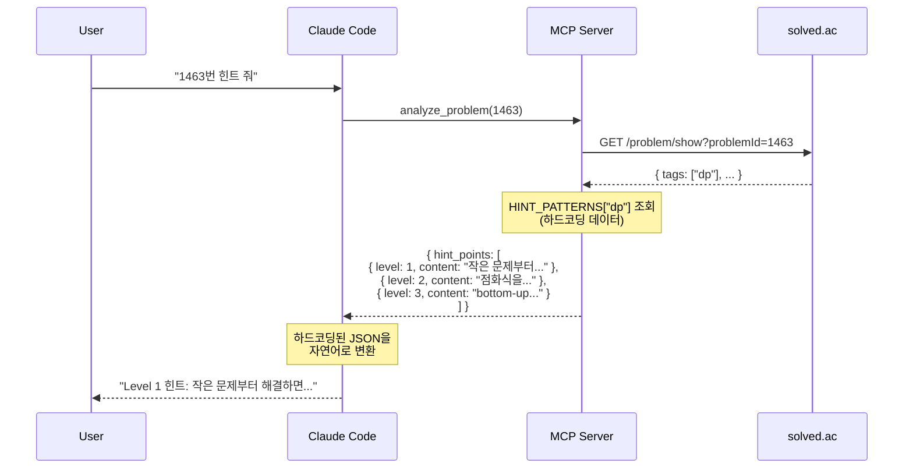
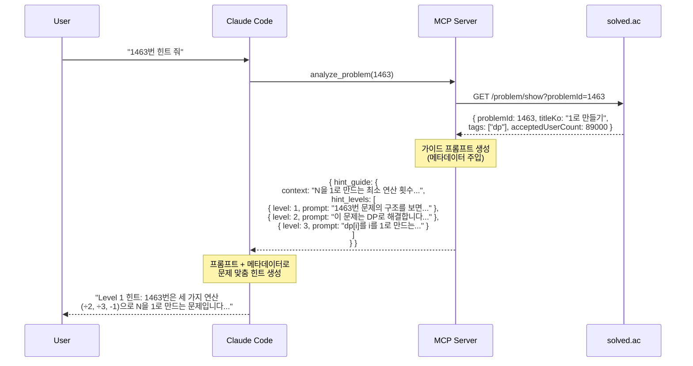

# 프롬프트 기반 아키텍처 설계서

**프로젝트명**: cote-mcp-server (BOJ 학습 도우미)
**버전**: 1.0
**작성일**: 2026-02-14
**마지막 업데이트**: 2026-02-14
**작성자**: technical-writer

---

## 목차

1. [개요](#1-개요)
2. [설계 원칙](#2-설계-원칙)
3. [데이터 흐름 (Before → After)](#3-데이터-흐름-before--after)
4. [타입 시스템 변경](#4-타입-시스템-변경)
5. [프롬프트 시스템 설계](#5-프롬프트-시스템-설계)
6. [서비스 변경 설계](#6-서비스-변경-설계)
7. [코드 규모 비교](#7-코드-규모-비교)
8. [테스트 전략](#8-테스트-전략)
9. [마이그레이션 계획](#9-마이그레이션-계획)
10. [Breaking Changes](#10-breaking-changes)
11. [위험 요소 및 완화](#11-위험-요소-및-완화)

---

## 1. 개요

### 1.1 배경

현재 `src/services/problem-analyzer.ts` 파일은 **1,453줄**의 하드코딩된 힌트 데이터를 포함하고 있습니다:

- **HINT_PATTERNS**: 35개 알고리즘 × 3레벨 = ~761줄
  ```typescript
  export const HINT_PATTERNS: Record<string, HintPattern> = {
    dp: { level1: {...}, level2: {...}, level3: {...} },
    greedy: { level1: {...}, level2: {...}, level3: {...} },
    // ... 33개 더
  };
  ```

- **TAG_EXPLANATIONS**: ~36줄
  ```typescript
  const TAG_EXPLANATIONS: Record<string, string> = {
    dp: "다이나믹 프로그래밍은...",
    greedy: "탐욕법은...",
    // ...
  };
  ```

- **Switch-case 블록들**: ~400줄
  - `getApproaches()`: 알고리즘별 접근 방법
  - `getComplexity()`: 복잡도 추정
  - `getGotchas()`: 주의사항
  - `structureAnalysis()`: 분석 정보 구조화

### 1.2 현재 문제점

| 문제 | 영향 | 예시 |
|------|------|------|
| **문제 특화 불가** | 모든 DP 문제에 동일 힌트 | 1463번 "1로 만들기"와 11066번 "파일 합치기" 동일 힌트 |
| **유지보수 부담** | 새 알고리즘 추가 시 6곳 수정 | HINT_PATTERNS, TAG_EXPLANATIONS, 4개 switch-case |
| **코드 비대화** | 1,453줄의 데이터 파일 | 로직 찾기 어려움, 리뷰 부담 |
| **테스트 취약성** | 하드코딩 데이터 검증만 가능 | 힌트 품질/적절성 평가 불가 |

### 1.3 해결 방안

**프롬프트 기반 아키텍처**로 전환:

- **MCP 서버**: solved.ac 메타데이터 + 가이드 프롬프트만 제공
- **Claude Code**: 프롬프트와 메타데이터를 기반으로 문제별 맞춤 힌트 생성
- **Zero Configuration**: 기존 Keyless 아키텍처 유지
- **결정적 출력**: MCP 서버 출력은 여전히 결정적 (테스트 가능)

---

## 2. 설계 원칙

### 2.1 역할 분리

```
┌─────────────────┐
│  MCP 서버       │ = 데이터 제공자
├─────────────────┤
│ - solved.ac 조회│
│ - 티어 변환     │
│ - 유사 문제 검색│
│ - 가이드 프롬프트│
└─────────────────┘
        ↓ JSON (결정적)
┌─────────────────┐
│  Claude Code    │ = 힌트 생성자
├─────────────────┤
│ - 프롬프트 실행 │
│ - 문제 특화 힌트│
│ - 자연어 대화   │
└─────────────────┘
```

### 2.2 핵심 원칙

1. **결정적 데이터 우선**: MCP 서버는 solved.ac 원본 데이터와 프롬프트 템플릿만 반환
2. **생성형 작업 위임**: Claude Code가 LLM 능력으로 문제별 맞춤 힌트 생성
3. **테스트 가능성 유지**: 프롬프트 구조와 변수 치환만 검증, 내용은 Claude에 위임
4. **Keyless 철학 유지**: API 키 설정 없이 즉시 사용 가능

### 2.3 장점

| 측면 | 이점 |
|------|------|
| **사용자 경험** | 문제마다 고유한 맥락 반영 힌트 |
| **개발 효율** | 코드 규모 69% 감소 (1,834줄 → 570줄) |
| **확장성** | 새 알고리즘 추가 시 1곳만 수정 (프롬프트) |
| **품질** | LLM의 추론 능력 활용 (단순 매칭 → 문맥 이해) |

---

## 3. 데이터 흐름 (Before → After)

### 3.1 Before (하드코딩 방식)



**문제점**:
- 1463번 "1로 만들기"든 11066번 "파일 합치기"든 모든 DP 문제에 **동일한 힌트**
- 문제 특성 (N 범위, 연산 종류, 제약 조건) 전혀 반영 안 됨

### 3.2 After (프롬프트 기반)



**개선점**:
- 1463번: "세 가지 연산(÷2, ÷3, -1)..."
- 11066번: "파일을 합치는 비용 최적화..."
- 각 문제의 **고유한 맥락** 반영

---

## 4. 타입 시스템 변경

### 4.1 제거되는 타입

| 타입 | 위치 | 이유 |
|------|------|------|
| `HintPoint` | `types/analysis.ts` | 정적 힌트 → `HintGuide` 프롬프트로 대체 |
| `AlgorithmInfo` | `types/analysis.ts` | 하드코딩 데이터 (explanations, approaches, complexity) 제거 |
| `Constraint` | `types/analysis.ts` | 난이도 기반 추정은 신뢰성 낮음. Claude Code가 직접 분석 |
| `Gotcha` | `types/analysis.ts` | 태그별 정적 주의사항 → Level 3 프롬프트에서 생성 |
| `HintPattern` | `problem-analyzer.ts` | HINT_PATTERNS 삭제로 불필요 |
| `AnalysisInfo` | `problem-analyzer.ts` | AlgorithmInfo 의존. HintGuide로 대체 |

### 4.2 새로운 타입

```typescript
/**
 * 문제 분석 결과 (프롬프트 기반)
 */
export interface ProblemAnalysis {
  problem: Problem;              // solved.ac 원본 데이터 (유지)
  difficulty: DifficultyContext; // 티어 변환 결과 (유지)
  tags: TagInfo[];               // 간소화된 태그 정보 (신규)
  similar_problems: Problem[];   // 유사 문제 (유지)
  hint_guide: HintGuide;         // 프롬프트 기반 가이드 (신규)
}

/**
 * 간소화된 태그 정보
 */
export interface TagInfo {
  key: string;       // "dp"
  name_ko: string;   // "다이나믹 프로그래밍"
}

/**
 * 힌트 생성 가이드 (Claude Code용 프롬프트)
 */
export interface HintGuide {
  context: string;                   // 문제 컨텍스트 요약
  hint_levels: HintLevelGuide[];     // 3단계 프롬프트
  review_prompts: ReviewPrompts;     // 복습 가이드
}

/**
 * 레벨별 힌트 생성 가이드
 */
export interface HintLevelGuide {
  level: 1 | 2 | 3;
  label: string;    // "패턴 인식" | "핵심 통찰" | "풀이 전략"
  prompt: string;   // 메타데이터가 주입된 가이드 프롬프트
}

/**
 * 복습 문서 생성 가이드
 */
export interface ReviewPrompts {
  solution_approach: string;   // 접근 방법 작성 가이드
  time_complexity: string;     // 시간 복잡도 분석 가이드
  space_complexity: string;    // 공간 복잡도 분석 가이드
  key_insights: string;        // 핵심 통찰 추출 가이드
  difficulties: string;        // 어려움 회고 가이드
}
```

### 4.3 유지되는 타입

| 타입 | 이유 |
|------|------|
| `Problem` | solved.ac API 응답 그대로 |
| `DifficultyContext` | 순수 데이터 변환 (티어 → 등급 문자열) |
| `ProblemData` | 복습 템플릿용 요약 (필드 유지) |
| `ReviewTemplate` | 구조 변경 필요 (analysis → hint_guide) |

### 4.4 타입 변경 상세

#### ProblemAnalysis

```diff
  export interface ProblemAnalysis {
    problem: Problem;
    difficulty: DifficultyContext;
-   algorithm: AlgorithmInfo;
-   hint_points: HintPoint[];
-   constraints: Constraint[];
-   gotchas: Gotcha[];
+   tags: TagInfo[];
+   hint_guide: HintGuide;
    similar_problems: Problem[];
  }
```

#### ReviewTemplate

```diff
  export interface ReviewTemplate {
    metadata: ProblemData;
    template: string;
-   analysis: AnalysisInfo;
+   hint_guide: HintGuide;
  }
```

---

## 5. 프롬프트 시스템 설계

### 5.1 파일 구조

```
src/prompts/
└── hint-guide.ts    # 모든 가이드 프롬프트 상수 및 유틸리티
```

### 5.2 핵심 상수

#### 5.2.1 HINT_SYSTEM_PROMPT

Claude Code의 역할과 행동 규칙을 정의합니다.

```typescript
/**
 * Claude Code가 힌트를 제공할 때 따를 시스템 프롬프트
 */
export const HINT_SYSTEM_PROMPT = `
당신은 백준 온라인 저지(BOJ) 알고리즘 문제 학습을 돕는 튜터입니다.

**역할**:
- 소크라테스식 교수법으로 학습자가 스스로 깨닫도록 유도
- 레벨별로 정보 공개 수준을 조절하여 적절한 난이도 유지
- 문제 메타데이터(티어, 태그, 정답률 등)를 활용하여 맥락 있는 힌트 제공

**원칙**:
1. Level 1 (패턴 인식): 알고리즘 이름을 직접 언급하지 말 것. 구조적 특징만 암시
2. Level 2 (핵심 통찰): 알고리즘을 명시하고 핵심 아이디어 설명. 구현 방법은 주지 않음
3. Level 3 (풀이 전략): 단계별 접근법과 의사코드 수준 가이드 제공

**금지 사항**:
- Level 1-2에서 전체 코드 제공 금지
- Level 3에서도 완전한 코드는 주지 말 것 (의사코드/골격만)
- 학습자가 요청하지 않은 레벨의 정보 누설 금지
`;
```

#### 5.2.2 HINT_LEVEL_PROMPTS

3단계 힌트 생성 템플릿입니다.

```typescript
/**
 * 레벨별 힌트 생성 프롬프트 템플릿
 */
export const HINT_LEVEL_PROMPTS = {
  level1: `
## Level 1: 패턴 인식

백준 {problemId}번 "{problemTitle}" 문제에 대한 첫 번째 힌트를 제공합니다.

**문제 정보**:
- 티어: {tier}
- 난이도: {percentile}
- 정답자 수: {acceptedUsers}명
- 평균 시도 횟수: {averageTries}회

**가이드라인**:
1. 알고리즘 이름({tags})을 직접 언급하지 마세요
2. 문제의 **구조적 특징**만 암시하세요
3. "작은 문제를 먼저 풀면...", "선택의 결과가..." 같은 간접적 표현 사용
4. 학습자가 패턴을 스스로 발견하도록 유도하세요

**출력 형식**:
- 2-3문장
- 질문 형태로 끝맺기 권장
`,

  level2: `
## Level 2: 핵심 통찰

백준 {problemId}번 "{problemTitle}" 문제에 대한 두 번째 힌트를 제공합니다.

**문제 정보**:
- 티어: {tier}
- 알고리즘: {tags}
- 정답자 수: {acceptedUsers}명

**가이드라인**:
1. 이제 알고리즘 이름({tags})을 명시하세요
2. **핵심 아이디어**를 설명하세요 (예: "부분 문제 결과 재사용", "매 단계 최선 선택")
3. 이 문제에서 **왜 이 알고리즘이 적합한지** 설명하세요
4. 구현 방법이나 코드는 주지 마세요

**출력 형식**:
- 4-5문장
- 구체적 예시 1개 포함 (문제 컨텍스트 기반)
`,

  level3: `
## Level 3: 풀이 전략

백준 {problemId}번 "{problemTitle}" 문제에 대한 세 번째 힌트를 제공합니다.

**문제 정보**:
- 티어: {tier}
- 알고리즘: {tags}
- 평균 시도 횟수: {averageTries}회 (주의사항 참고)

**가이드라인**:
1. **단계별 접근법** 제시 (예: "1단계: 초기화, 2단계: 순회...")
2. **주요 변수/자료구조** 제안 (예: "dp[i][j]는 ~를 의미")
3. **엣지 케이스** 주의사항 (예: "N=1일 때", "오버플로우 주의")
4. **의사코드 수준** 골격 제공 (완전한 코드 X)

**출력 형식**:
- 6-8문장
- 번호 매긴 단계
- 의사코드 블록 (선택적)
`,
};
```

#### 5.2.3 REVIEW_GUIDE_PROMPT

복습 문서 작성 코치 프롬프트입니다.

```typescript
/**
 * 복습 문서 작성 가이드 프롬프트
 */
export const REVIEW_GUIDE_PROMPT = `
당신은 백준 {problemId}번 "{problemTitle}" 문제를 풀고 있는 학습자의 복습 코치입니다.

**목표**: 학습자가 풀이를 구조화하여 기록하고, 핵심 통찰을 추출하도록 돕기

**진행 방식** (5단계 대화형):

1. **풀이 접근 방법**
   - 질문: "어떤 알고리즘으로 접근했나요? ({tags} 중 하나인가요?)"
   - 유도: "왜 그 알고리즘을 선택했나요?"

2. **시간 복잡도**
   - 질문: "코드의 시간 복잡도는 얼마인가요?"
   - 확인: "{tier} 문제인데, 이 복잡도면 시간 내에 통과 가능한가요?"

3. **공간 복잡도**
   - 질문: "어떤 자료구조를 사용했나요? 메모리는 얼마나 쓰나요?"

4. **핵심 통찰**
   - 질문: "이 문제의 핵심 아이디어는 무엇이었나요?"
   - 유도: "다시 풀 때 가장 먼저 떠올려야 할 것은?"

5. **어려웠던 점**
   - 질문: "어떤 부분에서 막혔나요? 어떻게 해결했나요?"
   - 회고: "다음에 비슷한 문제를 만나면 어떻게 대처할 건가요?"

**출력 형식**: 마크다운 템플릿에 학습자 답변 기록
`;
```

### 5.3 템플릿 변수

| 변수 | 소스 | 예시 | 용도 |
|------|------|------|------|
| `{problemId}` | `problem.problemId` | `1463` | 문제 식별 |
| `{problemTitle}` | `problem.titleKo` | `1로 만들기` | 문제명 표시 |
| `{tier}` | `difficulty.tier` | `Silver III` | 난이도 컨텍스트 |
| `{tags}` | `tags[].name_ko` joined | `다이나믹 프로그래밍` | 알고리즘 정보 |
| `{tagKeys}` | `tags[].key` joined | `dp` | 태그 키 (내부 로직용) |
| `{percentile}` | `difficulty.percentile` | `초급 (상위 70-80%)` | 상대 난이도 |
| `{acceptedUsers}` | `problem.acceptedUserCount` | `89000` | 정답자 수 (신뢰도) |
| `{averageTries}` | `problem.averageTries` | `2.8` | 난이도 지표 |

### 5.4 유틸리티 함수

```typescript
/**
 * 템플릿 문자열에 변수 주입
 * @example
 * interpolateTemplate("문제 {problemId}번", { problemId: "1463" })
 * // => "문제 1463번"
 */
export function interpolateTemplate(
  template: string,
  variables: Record<string, string | number>
): string {
  return template.replace(
    /\{(\w+)\}/g,
    (match, key) => String(variables[key] ?? match)
  );
}

/**
 * ProblemAnalysis에서 템플릿 변수 맵 생성
 */
export function buildTemplateVariables(
  analysis: Pick<ProblemAnalysis, "problem" | "difficulty" | "tags">
): Record<string, string | number> {
  return {
    problemId: analysis.problem.problemId,
    problemTitle: analysis.problem.titleKo,
    tier: analysis.difficulty.tier,
    percentile: analysis.difficulty.percentile,
    tags: analysis.tags.map((t) => t.name_ko).join(", "),
    tagKeys: analysis.tags.map((t) => t.key).join(", "),
    acceptedUsers: analysis.problem.acceptedUserCount.toLocaleString(),
    averageTries: analysis.problem.averageTries.toFixed(1),
  };
}
```

---

## 6. 서비스 변경 설계

### 6.1 ProblemAnalyzer (축소: 1,453줄 → ~200줄)

#### 제거되는 부분

```typescript
// ❌ 삭제: 761줄의 하드코딩 힌트 패턴
export const HINT_PATTERNS: Record<string, HintPattern> = { ... };

// ❌ 삭제: 36줄의 태그 설명
const TAG_EXPLANATIONS: Record<string, string> = { ... };

// ❌ 삭제: 400줄의 switch-case 블록들
private getApproaches(tagKey: string): string[] { ... }
private getComplexity(tagKey: string, tier: number): string { ... }
private getGotchas(tagKey: string): Gotcha[] { ... }
private structureAnalysis(tagKey: string): AnalysisInfo { ... }
```

#### 유지되는 부분

```typescript
/**
 * 문제 분석 오케스트레이션 (메인 로직)
 */
async analyze(problemId: number): Promise<ProblemAnalysis> {
  const problem = await this.apiClient.getProblem(problemId);
  const difficulty = this.buildDifficultyContext(problem);
  const tags = this.extractTags(problem);
  const similar = await this.findSimilarProblems(problem);
  const hintGuide = this.buildHintGuide(problem, difficulty, tags); // 신규

  return { problem, difficulty, tags, similar_problems: similar, hint_guide: hintGuide };
}

/**
 * 티어를 난이도 컨텍스트로 변환 (순수 데이터 변환)
 */
private buildDifficultyContext(problem: Problem): DifficultyContext { ... }

/**
 * 티어별 백분위수 계산
 */
private getPercentile(tier: number): string { ... }

/**
 * 유사 문제 찾기 (같은 태그 + 인접 티어)
 */
private async findSimilarProblems(problem: Problem): Promise<Problem[]> { ... }
```

#### 추가되는 부분

```typescript
/**
 * solved.ac 태그를 간소화된 TagInfo로 변환
 */
private extractTags(problem: Problem): TagInfo[] {
  return problem.tags.map((tag) => ({
    key: tag.key,
    name_ko: tag.displayNames.find((d) => d.language === "ko")?.name || tag.key,
  }));
}

/**
 * 힌트 가이드 프롬프트 생성 (프롬프트 + 메타데이터 주입)
 */
private buildHintGuide(
  problem: Problem,
  difficulty: DifficultyContext,
  tags: TagInfo[]
): HintGuide {
  const variables = buildTemplateVariables({ problem, difficulty, tags });

  return {
    context: this.buildContext(problem, difficulty, tags),
    hint_levels: [
      {
        level: 1,
        label: "패턴 인식",
        prompt: interpolateTemplate(HINT_LEVEL_PROMPTS.level1, variables),
      },
      {
        level: 2,
        label: "핵심 통찰",
        prompt: interpolateTemplate(HINT_LEVEL_PROMPTS.level2, variables),
      },
      {
        level: 3,
        label: "풀이 전략",
        prompt: interpolateTemplate(HINT_LEVEL_PROMPTS.level3, variables),
      },
    ],
    review_prompts: this.buildReviewPrompts(variables),
  };
}

/**
 * 문제 컨텍스트 요약 생성
 */
private buildContext(
  problem: Problem,
  difficulty: DifficultyContext,
  tags: TagInfo[]
): string {
  return `백준 ${problem.problemId}번 "${problem.titleKo}" (${difficulty.tier})
알고리즘: ${tags.map((t) => t.name_ko).join(", ")}
정답자: ${problem.acceptedUserCount.toLocaleString()}명 | 평균 시도: ${problem.averageTries.toFixed(1)}회`;
}

/**
 * 복습 프롬프트 생성
 */
private buildReviewPrompts(variables: Record<string, string | number>): ReviewPrompts {
  return {
    solution_approach: interpolateTemplate(REVIEW_GUIDE_PROMPT, variables),
    time_complexity: `시간 복잡도를 분석하세요. ${variables.tier} 문제는 대략 O(?)가 적합합니다.`,
    space_complexity: `공간 복잡도를 분석하세요. 어떤 자료구조를 사용했나요?`,
    key_insights: `이 문제의 핵심 아이디어를 한 문장으로 요약하세요.`,
    difficulties: `어떤 부분이 어려웠나요? 어떻게 극복했나요?`,
  };
}
```

### 6.2 ReviewTemplateGenerator (간소화: 240줄 → ~150줄)

#### 변경 사항

```diff
  export class ReviewTemplateGenerator {
    generate(analysis: ProblemAnalysis): ReviewTemplate {
      return {
        metadata: this.extractMetadata(analysis),
        template: this.generateTemplate(analysis),
-       analysis: this.structureAnalysis(analysis), // 삭제
+       hint_guide: analysis.hint_guide,            // 직접 사용
      };
    }

-   // ❌ 삭제: 하드코딩 분석 정보 구조화
-   private structureAnalysis(analysis: ProblemAnalysis): AnalysisInfo { ... }

-   // ❌ 삭제: 하드코딩 실수 패턴 생성
-   private generateCommonMistakes(tags: string[]): string[] { ... }

    // ✅ 유지: 메타데이터 추출
    private extractMetadata(analysis: ProblemAnalysis): ProblemData { ... }

    // ✅ 간소화: 템플릿 생성 (hint_guide 활용)
    private generateTemplate(analysis: ProblemAnalysis): string {
      return `
# [${analysis.problem.problemId}] ${analysis.problem.titleKo}

## 문제 정보
- 티어: ${analysis.difficulty.tier}
- 알고리즘: ${analysis.tags.map(t => t.name_ko).join(", ")}

## 풀이 접근
> ${analysis.hint_guide.review_prompts.solution_approach}

## 복잡도 분석
### 시간 복잡도
> ${analysis.hint_guide.review_prompts.time_complexity}

### 공간 복잡도
> ${analysis.hint_guide.review_prompts.space_complexity}

## 핵심 통찰
> ${analysis.hint_guide.review_prompts.key_insights}

## 어려웠던 점
> ${analysis.hint_guide.review_prompts.difficulties}
`;
    }
  }
```

### 6.3 Tool 핸들러 (최소 변경)

#### analyze-problem.ts

```diff
  server.tool(
    "analyze_problem",
    "문제 분석 및 힌트 가이드 제공",
    AnalyzeProblemInputSchema,
    async (args) => {
      const analysis = await analyzer.analyze(args.problemId);
      return {
        content: [
          {
            type: "text",
            text: JSON.stringify({
              problem: analysis.problem,
              difficulty: analysis.difficulty,
-             algorithm: analysis.algorithm,
-             hint_points: analysis.hint_points,
-             constraints: analysis.constraints,
-             gotchas: analysis.gotchas,
+             tags: analysis.tags,
+             hint_guide: analysis.hint_guide,
              similar_problems: analysis.similar_problems,
            }, null, 2),
          },
        ],
      };
    }
  );
```

#### generate-review-template.ts

```diff
  server.tool(
    "generate_review_template",
    "복습 템플릿 및 가이드 생성",
    GenerateReviewInputSchema,
    async (args) => {
      const analysis = await analyzer.analyze(args.problemId);
      const review = generator.generate(analysis);
      return {
        content: [
          {
            type: "text",
            text: JSON.stringify({
              metadata: review.metadata,
              template: review.template,
-             analysis: review.analysis,
+             hint_guide: review.hint_guide,
            }, null, 2),
          },
        ],
      };
    }
  );
```

---

## 7. 코드 규모 비교

### 7.1 파일별 비교

| 파일 | Before | After | 감소율 |
|------|--------|-------|--------|
| `services/problem-analyzer.ts` | 1,453줄 | ~200줄 | **86% 감소** |
| `prompts/hint-guide.ts` | - | ~120줄 | *(신규)* |
| `types/analysis.ts` | 141줄 | ~100줄 | 29% 감소 |
| `services/review-template-generator.ts` | 240줄 | ~150줄 | 38% 감소 |
| **총계** | **1,834줄** | **~570줄** | **69% 감소** |

### 7.2 데이터 vs 로직 분리

| 항목 | Before | After |
|------|--------|-------|
| **하드코딩 데이터** | ~1,200줄 (HINT_PATTERNS, TAG_EXPLANATIONS, switch-case) | 0줄 |
| **프롬프트 템플릿** | 0줄 | ~120줄 (hint-guide.ts) |
| **비즈니스 로직** | ~634줄 | ~450줄 |
| **테스트 코드** | ~400줄 (하드코딩 검증) | ~250줄 (프롬프트 구조 검증) |

---

## 8. 테스트 전략

### 8.1 MCP 서버 테스트 (결정적)

**원칙**: MCP 서버 출력은 여전히 **결정적**이므로 기존 테스트 철학 유지

#### 8.1.1 프롬프트 구조 검증

```typescript
describe("ProblemAnalyzer (프롬프트 기반)", () => {
  it("hint_guide에 3개 레벨이 모두 포함되어야 함", async () => {
    const analysis = await analyzer.analyze(1463);

    expect(analysis.hint_guide.hint_levels).toHaveLength(3);
    expect(analysis.hint_guide.hint_levels[0].level).toBe(1);
    expect(analysis.hint_guide.hint_levels[0].label).toBe("패턴 인식");
    expect(analysis.hint_guide.hint_levels[1].level).toBe(2);
    expect(analysis.hint_guide.hint_levels[2].level).toBe(3);
  });
});
```

#### 8.1.2 템플릿 변수 치환 검증

```typescript
it("프롬프트에 문제 메타데이터가 주입되어야 함", async () => {
  const analysis = await analyzer.analyze(1463);
  const level1Prompt = analysis.hint_guide.hint_levels[0].prompt;

  expect(level1Prompt).toContain("1463번");           // {problemId}
  expect(level1Prompt).toContain("1로 만들기");        // {problemTitle}
  expect(level1Prompt).toContain("Silver III");       // {tier}
  expect(level1Prompt).not.toContain("{problemId}"); // 치환 완료 확인
});
```

#### 8.1.3 solved.ac 데이터 파이프라인 (기존 유지)

```typescript
it("solved.ac API에서 문제 정보를 올바르게 가져와야 함", async () => {
  const analysis = await analyzer.analyze(1463);

  expect(analysis.problem.problemId).toBe(1463);
  expect(analysis.problem.titleKo).toBe("1로 만들기");
  expect(analysis.tags).toContainEqual({ key: "dp", name_ko: "다이나믹 프로그래밍" });
});
```

#### 8.1.4 스냅샷 테스트

```typescript
it("같은 입력에 대해 같은 프롬프트 출력 (결정적)", async () => {
  const analysis1 = await analyzer.analyze(1463);
  const analysis2 = await analyzer.analyze(1463);

  expect(analysis1.hint_guide).toEqual(analysis2.hint_guide); // 완전 동일
});
```

### 8.2 제거되는 테스트

| 테스트 케이스 | 이유 |
|---------------|------|
| TC-KL-2.1 ~ TC-KL-2.21 | 하드코딩 힌트 내용 검증 → Claude Code가 생성하므로 불필요 |
| `TAG_EXPLANATIONS` 매핑 | 정적 데이터 삭제 |
| `approaches`, `complexity`, `gotchas` 정확도 | 프롬프트로 대체 |
| `AlgorithmInfo` 구조 검증 | 타입 삭제 |

### 8.3 추가 통합 테스트 (선택적)

**수동 검증**: Claude Code가 생성한 힌트의 품질 평가

```typescript
// 이 테스트는 CI에서 실행되지 않음 (Claude API 필요)
describe.skip("Claude Code 통합 테스트", () => {
  it("Level 1 힌트가 알고리즘 이름을 누설하지 않는지 확인", async () => {
    const analysis = await analyzer.analyze(1463);
    const claudeResponse = await callClaudeAPI(analysis.hint_guide.hint_levels[0].prompt);

    expect(claudeResponse).not.toContain("다이나믹 프로그래밍");
    expect(claudeResponse).not.toContain("DP");
  });
});
```

---

## 9. 마이그레이션 계획

### Step 1: 새 파일 생성

```bash
# 프롬프트 시스템 생성
touch src/prompts/hint-guide.ts

# 프롬프트 상수 및 유틸리티 작성
# - HINT_SYSTEM_PROMPT
# - HINT_LEVEL_PROMPTS
# - REVIEW_GUIDE_PROMPT
# - interpolateTemplate()
# - buildTemplateVariables()
```

**예상 시간**: 1-2시간

### Step 2: 타입 업데이트

```bash
# src/types/analysis.ts 수정
# 1. 새 타입 추가 (이전 타입은 일시 유지)
#    - TagInfo
#    - HintGuide
#    - HintLevelGuide
#    - ReviewPrompts
# 2. ProblemAnalysis 타입 복제 → ProblemAnalysisV2 생성
```

**예상 시간**: 30분

### Step 3: 서비스 리팩토링

```bash
# 3.1 ProblemAnalyzer 재작성
# - HINT_PATTERNS, TAG_EXPLANATIONS 삭제
# - 6개 switch-case 메서드 삭제
# - extractTags(), buildHintGuide() 추가
# - analyze() 메서드 반환 타입 → ProblemAnalysisV2

# 3.2 ReviewTemplateGenerator 업데이트
# - structureAnalysis(), generateCommonMistakes() 삭제
# - generateTemplate()에서 hint_guide 사용
```

**예상 시간**: 3-4시간

### Step 4: 테스트 갱신

```bash
# 4.1 tests/services/problem-analyzer.test.ts 재작성
# - 하드코딩 힌트 검증 테스트 삭제
# - 프롬프트 구조 검증 추가
# - 템플릿 변수 치환 검증 추가
# - 스냅샷 테스트 추가

# 4.2 tests/services/review-template-generator.test.ts 업데이트
# - analysis → hint_guide 변경 반영
```

**예상 시간**: 2-3시간

### Step 5: 도구 핸들러 업데이트

```bash
# src/tools/analyze-problem.ts 수정
# - 반환 JSON 구조 변경

# src/tools/generate-review-template.ts 수정
# - ReviewTemplate 구조 변경
```

**예상 시간**: 30분

### Step 6: 정리

```bash
# 6.1 타입 정리
# - src/types/analysis.ts에서 미사용 타입 제거
#   - AlgorithmInfo, HintPoint, Constraint, Gotcha, HintPattern
# - ProblemAnalysisV2 → ProblemAnalysis로 이름 변경

# 6.2 문서 업데이트
# - docs/02-development/tools-reference.md
# - docs/01-planning/architecture.md
# - docs/01-planning/PRD.md
```

**예상 시간**: 1시간

### 총 예상 시간

**8-11시간** (1-2일 작업)

---

## 10. Breaking Changes

이 변경은 `analyze_problem` 도구의 **출력 JSON 구조를 변경**합니다.

### 10.1 제거되는 필드

| 필드 | 타입 | 대체 방법 |
|------|------|-----------|
| `algorithm` | `AlgorithmInfo` | `tags`로 알고리즘 목록 조회, `hint_guide`로 설명 획득 |
| `hint_points` | `HintPoint[]` | `hint_guide.hint_levels[].prompt` 사용 |
| `constraints` | `Constraint[]` | Claude Code가 직접 분석 (프롬프트에 티어 정보 포함) |
| `gotchas` | `Gotcha[]` | `hint_guide.hint_levels[2]` (Level 3)에서 생성 |

### 10.2 추가되는 필드

| 필드 | 타입 | 설명 |
|------|------|------|
| `tags` | `TagInfo[]` | 간소화된 태그 정보 (key, name_ko) |
| `hint_guide` | `HintGuide` | 힌트 생성 가이드 프롬프트 |

### 10.3 마이그레이션 예시

#### Before (하드코딩)

```json
{
  "problem": { "problemId": 1463, "titleKo": "1로 만들기" },
  "algorithm": {
    "name": "다이나믹 프로그래밍",
    "key": "dp",
    "explanation": "작은 문제부터..."
  },
  "hint_points": [
    { "level": 1, "content": "작은 문제부터 해결하면..." },
    { "level": 2, "content": "점화식을 세워보세요..." }
  ]
}
```

#### After (프롬프트 기반)

```json
{
  "problem": { "problemId": 1463, "titleKo": "1로 만들기" },
  "tags": [
    { "key": "dp", "name_ko": "다이나믹 프로그래밍" }
  ],
  "hint_guide": {
    "context": "백준 1463번 \"1로 만들기\" (Silver III)...",
    "hint_levels": [
      {
        "level": 1,
        "label": "패턴 인식",
        "prompt": "백준 1463번 \"1로 만들기\" 문제에 대한...\n**가이드라인**:\n1. 알고리즘 이름(다이나믹 프로그래밍)을 직접 언급하지 마세요..."
      }
    ]
  }
}
```

### 10.4 Claude Code 적응

Claude Code는 **자동으로 적응**합니다:

- Before: `analysis.hint_points[0].content`를 자연어로 변환
- After: `analysis.hint_guide.hint_levels[0].prompt`를 실행하여 힌트 생성

---

## 11. 위험 요소 및 완화

### 11.1 위험 요소

| 위험 | 영향도 | 확률 | 영향 |
|------|--------|------|------|
| **Claude Code의 힌트 품질 불균일** | 높음 | 중간 | 사용자 경험 저하 |
| **레거시 워크플로우 호환성 깨짐** | 중간 | 높음 | 기존 사용자 불편 |
| **프롬프트 유지보수 어려움** | 낮음 | 낮음 | 장기 관리 비용 증가 |
| **테스트 커버리지 감소** | 중간 | 중간 | 버그 탐지율 하락 |

### 11.2 완화 방안

#### 11.2.1 힌트 품질 보장

**프롬프트 가이드라인 강화**:

```typescript
// HINT_LEVEL_PROMPTS.level1에 추가
**금지 사항 (절대 하지 말 것)**:
- ❌ "다이나믹 프로그래밍", "DP" 같은 알고리즘 이름 언급
- ❌ "dp[i]", "for (int i = 0; ...)" 같은 구현 힌트
- ❌ Level 2-3 정보 누설 (핵심 통찰, 풀이 전략)

**검증 절차**:
- 답변 작성 후 스스로 금지 사항 체크
- 학습자가 "너무 쉽다" 또는 "너무 어렵다" 피드백 시 레벨 조정
```

#### 11.2.2 레거시 호환성 유지

**문서에 마이그레이션 가이드 추가**:

```markdown
## 기존 사용자를 위한 가이드

### Before (하드코딩 시절)
"1463번 Level 2 힌트 줘" → 정적 힌트 반환

### After (프롬프트 기반)
"1463번 Level 2 힌트 줘" → Claude가 문제 맞춤 힌트 생성

**변경 사항**:
- 같은 태그 문제도 이제 서로 다른 힌트 제공
- 힌트 요청 방법은 동일 (자연어 그대로)
```

#### 11.2.3 프롬프트 관리 전략

**TypeScript 상수로 관리**:

```typescript
// ✅ 타입 안전, IDE 지원, 리팩토링 용이
export const HINT_LEVEL_PROMPTS = { ... } as const;

// ❌ 별도 파일 관리 (JSON, YAML)은 타입 안전성 부족
```

**버전 관리**:

```typescript
export const HINT_PROMPT_VERSION = "1.0.0";

export interface HintGuide {
  prompt_version: string; // 향후 프롬프트 변경 시 추적
  hint_levels: HintLevelGuide[];
}
```

#### 11.2.4 테스트 전략 보완

**프롬프트 구조 테스트 (자동)**:

```typescript
it("모든 템플릿 변수가 치환되어야 함", () => {
  const prompt = analysis.hint_guide.hint_levels[0].prompt;
  const unreplacedVars = prompt.match(/\{(\w+)\}/g);
  expect(unreplacedVars).toBeNull(); // 치환되지 않은 변수 없음
});
```

**수동 품질 검증**:

- Phase 4 배포 전 10개 대표 문제 수동 테스트
- 레벨별 힌트 적절성 확인
- 사용자 피드백 수집 메커니즘 마련

---

## 12. 결론

### 12.1 핵심 성과

- **코드 규모 69% 감소** (1,834줄 → 570줄)
- **확장성 대폭 향상** (새 알고리즘 추가 시 1곳만 수정)
- **힌트 품질 개선** (문제별 맥락 반영 가능)
- **Keyless 철학 유지** (MCP 서버는 여전히 결정적 출력)

### 12.2 다음 단계

1. **Phase 4 구현**: 이 설계서를 기반으로 코드 작성
2. **테스트 작성**: 프롬프트 구조 검증 중심
3. **문서 업데이트**: architecture.md, tools-reference.md 반영
4. **사용자 피드백**: 베타 테스트 및 개선

---

**문서 변경 이력**:

| 날짜 | 버전 | 변경 내용 | 작성자 |
|------|------|-----------|--------|
| 2026-02-14 | 1.0 | 초안 작성 | technical-writer |
